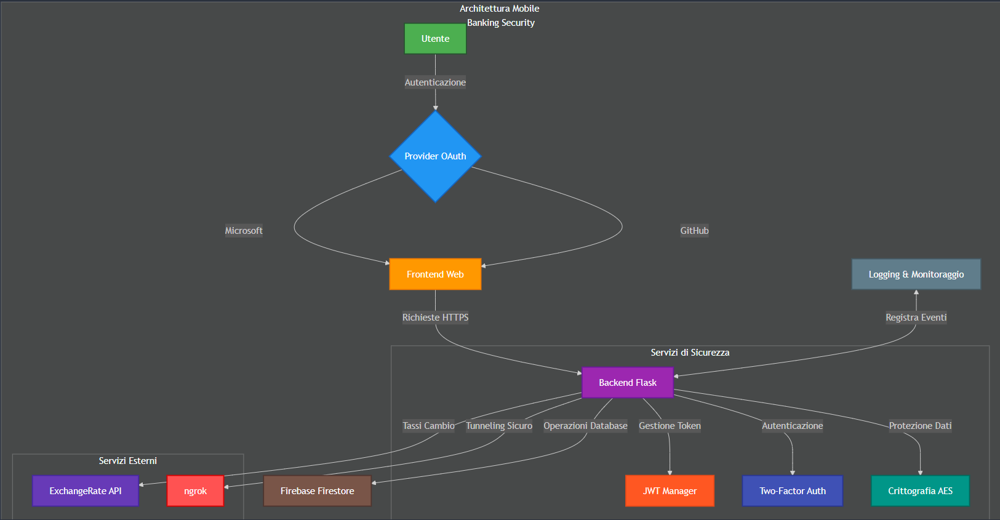
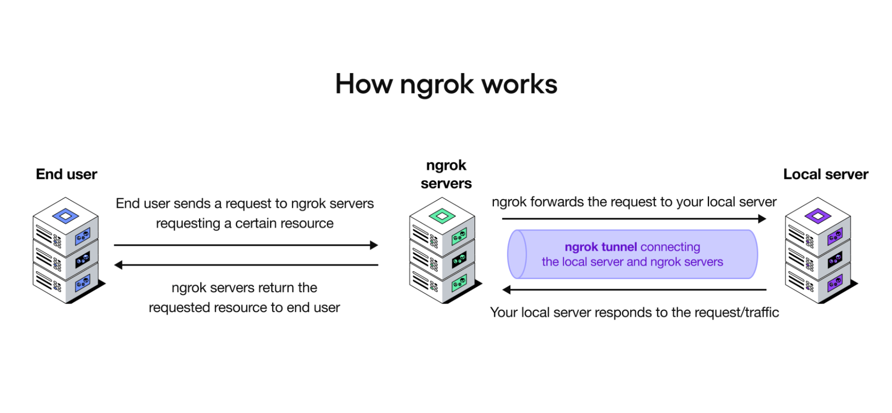
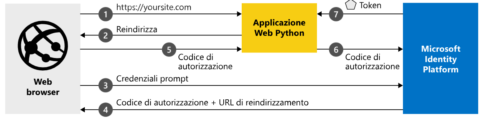
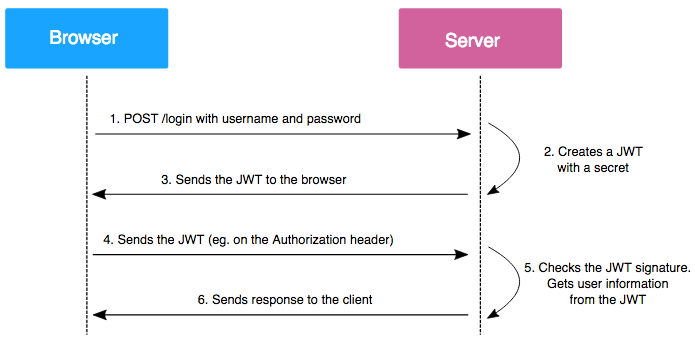

# **Mobile Banking Security Project**
# **Università Degli Studi di Bari Aldo Moro**
**Corso di Laurea Magistrale in Sicurezza Informatica**

**Corso**: *Sicurezza delle Architetture Orientate ai Serivizi*

**Docente**: *Prof. Giulio Mallardi*

**Studente**: *Giacomo Pagliara*

## Introduzione
Il progetto consiste in una web app per la simulazione di un sistema di Mobile Bnaking, finalizzata a gestire operazioni bancarie standard in maniera sicura ed interattiva. L'applicazione prevede l'accesso tramite OAuth 2.0 (con Microsoft e GitHub), mette a disposizione funzionalità di gestione del proprio conto corrente virtuale e implementa diverse misure di sicurezza per proteggere i dati degli utenti e garantire l'integrità del modello stesso.

## Funzionalità

**Mobile Banking Security** implementa diverse funzionalità. In particolare, la web app offre:

- **Autenticazione**:

    - **OAuth 2.0**: Gli utenti possono accedere tramite Microsoft o GitHub, sfruttando il flusso di autenticazione standard per ottenere l'accesso sicuro.


- **Dashboard Utente**:

    - **Visualizzazione del Saldo**: Gli utenti possono vedere il saldo attuale del proprio conto.

    - **Aggiunta di Fondi**: Gli utenti possono aggiungere fondi al proprio conto.
   
    - **Gestione delle Transazioni**:

        - **Creazione delle Transazioni**: Possibilità di effettuare transazioni inserendo importo, beneficiario, IBAN e descrizione.
        - **Verifica delle Transazioni**: Prima dell'esecuzione, il sistema effettua controlli sul saldo disponibile, sulla validità dell'IBAN e sui limiti (importo massimo per transazione, limite giornaliero e mensile).
        - **Storico delle Transazioni**: La dashboard mostra le ultime transazioni eseguite, una sorta di storico.

- **Token API e JWT**:

    - **Generazione Token**: Gli utenti autenticati possono generare token API basati su JWT, utilizzabili per accedere in modo sicuro alle API protette, principalmente per visualizzare il saldo.
    - **Revoca e Verifica**: È possibile revocare i token e verificarne la validità.

- **2FA Autenticazione a due fattori per operazioni critiche**:

    - **Autenticazione a Due Fattori**: Per operazioni critiche come il deposito, la web app richiede l'inserimento di un codice OTP.
    - **Setup del 2FA**: Se l'utente non ha ancora configurato il 2FA, viene generato un QR Code che può essere scansionato con un'app di autenticazione, che spieghremo più avanti.

- **Conversione Valuta**:

    - **Tassi di Cambio in Tempo Reale**: L'app consulta i tassi di cambio correnti tramite [ExchangeRate-API](https://www.exchangerate-api.com/ "ExchangeRate-API").
    - **Utilizzo di un Convertitore**: Gli utenti possono convertire importi da EUR ad altre valute (USD, GBP, JPY, CHF, AUD) direttamente dalla dashboard.


## Architettura del Sistema
Questa è l'architettura del sistema:



## Panoramica Architetturale
Mobile Banking Security è progettato seguendo un'architettura modulare e orientata ai servizi, con un focus specifico sulla sicurezza. L'architettura si compone di diversi layer interconnessi che garantiscono prestazioni, scalabilità e, soprattutto, la protezione dei dati.


- **L'applicazione segue un'architettura REST suddivisa in**:

    - Frontend: HTML, CSS, JavaScript per la gestione dell'interfaccia utente.

    - Backend: Flask per la gestione delle API e della logica di business.

    - Database: Firestore (NoSQL) per la memorizzazione sicura delle informazioni.

- **Servizi di sicurezza**:
    - Autenticazione e Autorizzazione:
        - Integrazione OAuth 2.0 con provider multipli => Microsoft e GitHub
        - Sistema di Autenticazione a due fattori (2FA)
        - Gestione token JWT per le API
        - Gestione sicura delle sessioni utente
        - Security Headers configurati
    - Protezione dei Dati e dell'infrastruttura:
        - Crittografia AES per dati sensibili
        - HTTPS tramite *ngrok* per la comunicazione client-server
        - Protezione contro attacchi CSRF
        - Content Security Polict (CSP)
        - Security Headers configurati
    - Controllo Accessi
        - Rate Limiting sugli endpoint critici
        - Gestione delle sessioni
        - Validazione delle autorizzazioni per ogni endpoint
    - Sicurezza delle Transazioni
        - Validazione IBAN
        - Limiti per le transazioni
        - Verifica 2FA per operazioni critiche

- **Integrazioni API Esterne Exchange Rate API**
L'applicazione integra il servizio Exchange Rate API per fornire tassi di cambio in tempo reale. L'integrazione è implmentata attraverso due endpoint principali:
- **Recupero Tassi di Cambio**
- **Conversione Valute**
Verrano descritti successivamente.
La valuta base è EUR.
Le valute supportate sono: USD,GBP,JPY,CHF,AUD.
L'aggiornamento automatico dei tassi avviene ogni 5 minuti.


**Flusso di funzionamento**

1. Login OAuth2 → L'utente si autentica tramite Microsoft o GitHub.

2. Gestione della sessione → Dopo il login, viene generato un token JWT per proteggere la richiesta di visualizzazione del saldo.

3. Interazione con la dashboard → L'utente può consultare il saldo, effettuare transazioni, convertire le varie valute e generare token API, ovvero JWT per visualizzare il saldo.

4. Sicurezza dei dati → Le richieste sono protette con CSRF, i dati sensibili sono crittografati e il rate limiting previene attacchi DoS e DDoS.

5. Gestione delle transazioni → Il backend verifica la disponibilità del saldo e registra la transazione su Firestore.

### Utilizzo di ngrok per HTTPS

Nel contesto di questo progetto di Mobile Banking, l'utilizzo di HTTPS è fondamentale per garantire la sicurezza delle comunicazioni. Per questo scopo, è stato implementato ngrok, un tool che fornisce tunnel sicuri verso il server locale.

#### Cos'è ngrok
ngrok è uno strumento che crea un tunnel sicuro (HTTPS) verso il server di sviluppo locale, permettendo:
- Esposizione sicura dell'applicazione locale su Internet
- Generazione di un URL HTTPS pubblico
- Ispezione del traffico in tempo reale
- Testing dei webhook e delle integrazioni OAuth

#### Utilizzo nel Progetto
ngrok è stato fondamentale per:
1. **Autenticazione OAuth**:
   - Fornire gli URL di callback HTTPS validi per Microsoft e GitHub OAuth
   - Permette ai provider di autenticazione di raggiungere l'applicazione in sviluppo

2. **Sicurezza delle Comunicazioni**:
   - Garantisce che tutte le comunicazioni siano cifrate
   - Simula un ambiente di produzione sicuro
   - Testa le funzionalità di sicurezza in un contesto HTTPS

3. **Testing delle Integrazioni**:
   - Verifica il corretto funzionamento delle callback OAuth dei vari provider
   - Testa le integrazioni con Exchange Rate API
   - Effettua il debugging delle richieste in tempo reale




## Autenticazione OAuth 2.0

L'applicazione utilizza OAuth 2.0 per consentire agli utenti di autenticarsi in modo sicuro tramite Microsoft e GitHub. Questo metodo elimina la necessità di memorizzare le password nel sistema, affidando l'autenticazione direttamente ai provider esterni, evitando i classici form di signUp e LogIn.

**Autenticazione con Microsoft**
Microsoft implementa il flusso Authorization Code con PKCE e OpenID Connect.
Come funziona:

- L'utente sceglie di accedere con Microsoft.

- Viene generato un codice di sicurezza (state) per proteggere la sessione.

- L'utente viene reindirizzato alla pagina di login di Microsoft.

- Dopo aver effettuato l'accesso, Microsoft reindirizza l'utente all'applicazione con un codice temporaneo.

- Il backend utilizza questo codice per ottenere un token di accesso e recuperare le informazioni dell'utente.

- I dati dell'utente vengono salvati in modo sicuro nel database e l'utente viene reindirizzato alla dashboard.



**Autenticazione con GitHub**
GitHub utilizza il flusso Authorization Code standard.
Come funziona:

- L'utente sceglie di accedere con GitHub.

- Viene reindirizzato alla pagina di login di GitHub.

- Dopo l'autenticazione, GitHub restituisce un codice di autorizzazione all'applicazione.

- Il backend scambia il codice per ottenere un token di accesso e recupera le informazioni dell'utente.

- I dati vengono salvati nel database e l'utente viene reindirizzato alla dashboard.

**Misure di sicurezza per entrambe**:

- Protezione CSRF: viene utilizzato un codice di sicurezza per evitare attacchi.

- Verifica email: viene controllato che l'email dell'utente sia verificata.

- Crittografia dei dati: i dati sensibili vengono salvati in modo cifrato.

- Limitazione dei tentativi di login: per prevenire attacchi di forza bruta.

- Rotazione della sessione: ogni volta che l'utente accede, viene creata una nuova sessione per maggiore sicurezza.

**Gestione Post-Autenticazione**:

Dopo l'accesso, il sistema garantisce la sicurezza dell'utente:

1. Crittografia dei dati → L'email dell'utente viene salvata in modo sicuro nel database.

2. Creazione del profilo utente → Se è un nuovo utente, viene creato un account con saldo iniziale pari a zero.

3. Sessione protetta →

    - Cookie di sessione sicuro (httpOnly e Secure).

    - Timeout configurabile per evitare sessioni attive troppo a lungo.

    - Rotazione della sessione per evitare il furto di sessione.

4. Reindirizzamento alla dashboard → L'utente può ora accedere alle funzionalità dell'app.

### Microsoft vs GitHub OAuth 2.0

I due provider di autenticazione, sebbene entrambi utilizzino OAuth 2.0, presentano alcune differenze significative nel loro approccio:

#### Microsoft OAuth 2.0
- Utilizza OpenID Connect in aggiunta a OAuth 2.0, fornendo un layer aggiuntivo di sicurezza
- Fornisce accesso a informazioni più dettagliate del profilo utente attraverso Microsoft Graph API
- Richiede più permessi specifici per accedere alle diverse informazioni dell'utente
- Offre un sistema di autenticazione più strutturato

#### GitHub OAuth 2.0
- Utilizza OAuth 2.0 standard
- Focus principale sull'accesso all'email verificata dell'utente
- Sistema più semplice e diretto

#### Differenze Principali
1. **Informazioni Utente**:
   - Microsoft: fornisce un set completo di informazioni utente (nome, email, foto profilo)
   - GitHub: focus principalmente sull'email verificata dell'utente

2. **Complessità**:
   - Microsoft: implementazione più complessa ma più ricca di funzionalità
   - GitHub: implementazione più snella e diretta

3. **Sicurezza**:
   - Microsoft: layer aggiuntivo con OpenID Connect
   - GitHub: sicurezza standard OAuth 2.0

## Autenticazione a Due Fattori (2FA)

L'autenticazione a due fattori (2FA) è una misura di sicurezza aggiuntiva implementata nel sistema per proteggere le operazioni critiche come depositi e transazioni. 

### Come Funziona il 2FA nel Sistema

#### Setup Iniziale
1. Durante la prima registrazione, viene generato un codice QR univoco per l'utente
2. L'utente deve scansionare questo codice raffigurato tramite QR Code con un'app di autenticazione (come Google Authenticator o Duo Mobile)
3. L'app genera codici temporanei (OTP - One Time Password) che cambiano ogni 30 secondi

#### Utilizzo nelle Operazioni
- Utilizzato Per operazioni critiche come:
  - Deposito di fondi
  - Trasferimento di denaro
- Il sistema richiede:
  1. Autenticazione standard (già effettuata con OAuth 2.0)
  2. Inserimento del codice OTP dall'app di autenticazione

### Misure di Sicurezza
- Il secret del 2FA viene salvato crittografato nel database
- I codici OTP sono validi solo per 30 secondi
- C'è un Limite di tentativi per l'inserimento del codice
- Protezione contro attacchi di forza bruta

### Processo di Verifica
1. L'utente richiede di effettuare un'operazione critica
2. Il sistema mostra la richiesta del codice che corrisponde al codice OTP del sistema 2FA
3. L'utente inserisce il codice dalla sua app di autenticazione
4. Il sistema verifica la validità del codice
5. Se il codice è corretto, l'operazione viene completata

### Routes per la Gestione 2FA
#### 1. Setup 2FA
- GET /api/2fa/setup 
Questa route si occupa della configurazione iniziale del 2FA:
    - Genera un secret unico per l'utente
    - Crea un QR code che può essere scansionato con l'app di autenticazione
    - Il secret viene salvato crittografato nel database
#### 2. Verifica Stato 2FA
- GET /api/2fa/check-status
Verifica se il 2FA è già stato configurato per l'utente:
    - Controlla se l'utente ha già attivato il 2FA
    - Restituisce lo stato corrente della configurazione
    - Utilizzato, per decidere se mostrare il setup o procedere con la verifica
#### 3. Conferma setup 2FA
- POST /api/2fa/confirm-setup
Completa il processo di attivazione del 2FA:
    - Conferma se il setup è stato completato con successo
    - Attiva il 2FA per l'account dell'utente

## Gestione delle Transazioni

## Panoramica
Le route per la gestione delle transazioni sono progettate per offrire un controllo completo e sicuro delle operazioni finanziarie nell'applicazione di mobile banking.

## Endpoint per la Verifica Transazioni
**Route**: `/api/transactions/verify`
**Metodo HTTP**: POST

### Descrizione
Questo endpoint rappresenta il punto di controllo principale per le transazioni finanziarie. Prima di autorizzare un trasferimento di denaro, esegue una serie di validazioni.

### Fasi di Validazione

1. **Validazione IBAN**
   - Verifica del formato corretto dell'IBAN
   - Controllo specifico per gli IBAN italiani
   - Utilizzo di espressioni regolari e algoritmi di validazione

2. **Controllo Limiti Transazionali**
   Sistema di controllo multi-livello per prevenire transazioni anomale:
   - Limite per singola transazione: 10.000€
   - Limite giornaliero: 50.000€
   - Limite mensile: 100.000€

3. **Verifica Disponibilità Fondi**
   - Confronto dell'importo con il saldo corrente
   - Prevenzione di transazioni che genererebbero saldo negativo

4. **Autenticazione Two-Factor (2FA)**
   - Richiesta di codice OTP (One-Time Password)
   - Finestra di validità ristretta (30 secondi)
   - Limite massimo di 3 tentativi di inserimento

### Sicurezza
- Prevenzione di frodi e trasferimenti non autorizzati
- Protezione dell'integrità finanziaria dell'utente
- Controllo granulare sulle transazioni

## Endpoint per la Creazione Transazioni
**Route**: `/api/transactions`
**Metodo HTTP**: POST

### Descrizione
Questo endpoint gestisce la creazione di nuove transazioni dopo il superamento delle verifiche preliminari.

### Funzionalità Principali
- Registrazione della transazione nel database
- Aggiornamento del saldo utente
- Generazione di un identificativo unico per la transazione

### Processo di Creazione
1. Verifica dell'autenticazione utente
2. Validazione dei dati della transazione
4. Registrazione e aggiornamento del saldo


## Endpoint per il Recupero Transazioni
**Route**: `/api/transactions`
**Metodo HTTP**: GET

### Descrizione
Questo endpoint permette di recuperare lo storico delle transazioni dell'utente.

### Funzionalità
- Recupero delle ultime transazioni
- Ordinamento cronologico inverso, dalle piu recenti
- Limitazione del numero di transazioni restituite, rate limiter

### Sicurezza
- Accesso consentito solo ad utenti autenticati
- Decriptazione sicura dei dati sensibili
- Protezione contro l'accesso non autorizzato

### Dettagli Restituiti
- Tipo di transazione (entrata/uscita)
- Importo
- Beneficiario
- IBAN
- Descrizione
- Data e ora
- Stato della transazione

### Principi di Sicurezza
- Autenticazione rigorosa
- Validazione completa degli input
- Controlli sui limiti di transazione
- Autenticazione a due fattori
- Crittografia dei dati sensibili
- Logging dettagliato degli eventi

## Route per la Gestione dei Token JWT
JSON Web Tokens, standard RFC 7519, permette funzionalità di autenticazione tramite invio di documenti, in formato JSON, firmati o crittografati. Il JWT è composto da tre parti:

**Header**: contiene informazioni riguardo l'algoritmo di hash per la generazione della firma (alg, solitamente HS256/HMAC-SHA256) e il tipo di JWT (typ).

**Payload**: i dati che vengono trasmessi, in genere composto da tre campi: timestamp di emissione (iat), timestamp di scadenza (exp) e oggetto (sub). Possono esserci ulteriori campi/claims, come previsto dallo standard.

**Signature**: il campo in cui è contenuta la firma per verificare l'integrità del payload
Il funzionamento del JWT è descritto nella seguente immagine:



## Panoramica

I token JWT (JSON Web Token) rappresentano un meccanismo cruciale per l'autenticazione e l'autorizzazione sicura nelle API che fanno parte del sistema di mobile banking.

## Endpoint per la Generazione di Token
**Route**: `/api/token/generate`
**Metodo HTTP**: POST

### Descrizione
Questo endpoint permette la generazione di token di accesso API univoci e temporanei, utilizzabili per autenticare richieste specifiche, ovvero la visualizzazione del saldo.

### Caratteristiche Principali
- Generazione di token con durata predefinita (7 giorni)
- Associazione a metadati specifici dell'utente
- Identificativo univoco per ogni token
- Tracciabilità e revocabilità
- Il token viene firmato con la chiave segreta JWT

### Processo di Generazione
1. Verifica dell'autenticazione utente
2. Il sistema genera:
   - Token ID univoco (UUID)
   - JTI (JWT ID) univoco
   - Claims personalizzate (tipo token, descrizione, etc.)
3. Definizione di claims aggiuntive
   - Tipo di token
   - Identificativo
   - Descrizione
   - Metodo di autenticazione originale, ovvero se il provider con cui l'utente è connesso è Microsoft o Github
4. Salvataggio dei metadati del token nel database

### Obiettivi di Sicurezza
- Limitare la durata dell'accesso
- Permettere revoca granulare dei token
- Tracciare l'origine e l'utilizzo dei token

## Endpoint per il Recupero dei Token
**Route**: `/api/tokens`
**Metodo HTTP**: GET

### Descrizione
Questo endpoint consente di recuperare la lista dei token API attivi, generati dall'utente.

### Funzionalità
- Recupero di tutti i token attivi
- Visualizzazione dei metadati specifici relativi all'utente
- Informazioni su creazione e scadenza

### Dettagli Restituiti
- Identificativo del token
- Descrizione
- Data di creazione
- Data di scadenza
- Ultimo utilizzo (se disponibile)

## Endpoint per la Revoca dei Token
**Route**: `/api/token/revoca/<token_id>`
**Metodo HTTP**: POST

### Descrizione
Permette di invalidare e revocare un token API specifico, impedendone ulteriori utilizzi.

### Processo di Revoca
1. Verifica dell'esistenza del token
2. Controllo che il token appartenga all'utente
3. Aggiunge il JTI alla blacklist
4. Aggiornamento dello stato del token nel database
5. Aggiunta alla blacklist del JWT per evitare il riutilizzo

### Meccanismi di Sicurezza
- Verifica che il token appartenga all'utente richiedente
- Impossibilità di revocare token di altri utenti
- Rate limiting per prevenire abusi
- Registrazione dell'evento di revoca

## Endpoint di Verifica Token
**Route**: `/api/token/verify`
**Metodo HTTP**: POST

### Descrizione
Consente la verifica della validità e delle caratteristiche di un token JWT.

### Funzionalità
- Controllo della validità del token
- Decodifica del token JWT
- Verifica della firma
- Controllo scadenza
- Verifica nella blacklist
- Aggiornamento del timestamp per indicare l'ultimo utilizzo

### Informazioni Verificate
- Stato di validità
- Data di creazione
- Data di scadenza
- Ultimo utilizzo

### Principi di Sicurezza
- Generazione di token con scadenza
- Blacklist per token revocati
- Possibilità di revoca
- Tracciamento dell'utilizzo
- Protezione contro riutilizzo di token, ovvero la blacklist


## Gestione dei Depositi

## Panoramica
Il sistema implementa un processo sicuro di deposito dei fondi che richiede la verifica dell'identità dell'utente attraverso l'autenticazione a due fattori (2FA). Questo garantisce che solo l'utente legittimo possa aggiungere fondi al proprio conto.

## Endpoint per  effettuare il deposito e la Richiesta OTP
**Route**: `/api/deposit/request-otp`
**Metodo HTTP**: POST

### Descrizione
Questo endpoint gestisce la fase iniziale del processo di deposito, generando un codice OTP necessario per verificare l'operazione.

### Funzionalità Principali
- Rate limiting: 3 tentativi al minuto
- Validazione dell'importo del deposito
- Generazione del QR code per 2FA (se non già configurato perche potrebbe essere configurato già con l'invio di una transazione, ovviamente verrà controllato sempre prima il saldo del conto)

**CONSIGLIO**: Configurare la 2FA attraverso il deposito, in modo tale da poter controllare prima il saldo.

### Processo di Richiesta
1. **Validazione Iniziale**:
   - Verifica dell'autenticazione utente
   - Controllo dell'importo (limiti: > 0 e ≤ 10.000€, già spiegati in precedenza)

2. **Gestione 2FA**:
   - Recupero del secret 2FA dell'utente
   - Generazione dell'URI per il QR code
   - Associazione con l'app di autenticazione

3. **Salvataggio Temporaneo**:
   - Memorizzazione dell'importo da depositare
   - Timeout di 5 minuti per completare l'operazione

## Endpoint per la Verifica dell'OTP e completare il Deposito 
**Route**: `/api/deposit/verify-otp`
**Metodo HTTP**: POST

### Descrizione
Questo endpoint completa il processo di deposito verificando il codice OTP fornito dall'utente.

### Misure di Sicurezza
- Rate limiting: 3 tentativi al minuto, 10 all'ora
- Finestra di validità OTP: 30 secondi
- Verifica della provenienza della richiesta

### Processo di Verifica

1. **Validazione OTP**:
  - Ricezione del codice OTP e dell'importo
  - Decrittazione del secret 2FA
  - Verifica della validità del codice

2. **Aggiornamento Saldo**:
  - Calcolo del nuovo saldo
  - Aggiornamento del database
  - Attivazione del 2FA se non già attivo

3. **Conferma Operazione**: 
  - Generazione risposta di successo
  - Restituzione del nuovo saldo


## Gestione dei Tassi di Cambio

## Panoramica
Il sistema fornisce funzionalità di conversione valuta in tempo reale attraverso l'integrazione con Exchange Rate API. Questa integrazione permette agli utenti di visualizzare i tassi di cambio correnti e convertire importi tra diverse valute.

## Endpoint per il Recupero dei Tassi di Cambio
**Route**: `/api/exchange-rates`
**Metodo HTTP**: GET

### Descrizione
Questo endpoint recupera i tassi di cambio correnti rispetto all'EUR (valuta base) per le principali valute supportate.

### Caratteristiche Principali
- Rate limiting: 30 richieste al minuto
- Aggiornamento automatico ogni 5 minuti
- Valute supportate: USD, GBP, JPY, CHF, AUD

### Processo di Recupero
1. **Verifica Autenticazione**:
  - Controllo della sessione utente
  - Validazione dell'accesso, importante

2. **Chiamata API Esterna**:
  - Utilizzo della API key di Exchange Rate API
  - Richiesta dei tassi correnti con EUR come base

3. **Elaborazione Risposta**:
  - Filtraggio delle valute supportate
  - Formattazione dei tassi di cambio


## Endpoint per la Conversione delle Valute
**Route**: `/api/convert`
**Metodo HTTP**: POST

### Descrizione
Questo endpoint permette la conversione di importi da EUR a una delle valute supportate, utilizzando i tassi di cambio in tempo reale.

### Caratteristiche Principali
- Rate limiting: 30 richieste al minuto
- Validazione degli importi
- Conversione precisa con arrotondamento a 2 decimali

### Processo di Conversione
1. **Validazione Input**:
  - Verifica della validità dell'importo
  - Controllo della valuta di destinazione

2. **Richiesta Tasso di Cambio**:
  - Recupero del tasso corrente da Exchange Rate API
  - Verifica della validità del tasso

3. **Calcolo Conversione**:
  - Applicazione del tasso di cambio
  - Arrotondamento del risultato

### Gestione Errori
- **400**: Dati richiesta non validi
- **401**: Utente non autorizzato
- **429**: Limite richieste superato
- **500**: Errore servizio esterno

### Misure di Sicurezza
1. **Protezione API**:
  - Rate limiting per prevenire abusi
  - Validazione degli input
  - Gestione sicura delle API key

2. **Precisione Dati**:
  - Arrotondamento controllato
  - Validazione dei tassi di cambio
  - Gestione degli errori di conversione

3. **Integrità del Servizio**:
  - Monitoraggio delle chiamate API
  - Logging delle conversioni
  - Gestione dei timeout

## Route di Base dell'Applicazione

## Home Page
**Route**: `/`
**Metodo HTTP**: GET

### Descrizione
Endpoint principale dell'applicazione che gestisce l'accesso iniziale degli utenti. Questa route presenta la pagina di login con le opzioni di autenticazione disponibili Microsoft o GitHub.

### Funzionalità
- Pulizia della sessione esistente
- Presentazione delle opzioni di login (Microsoft e GitHub)
- Caricamento dei client ID necessari per OAuth
- Renderizzazione del template di login verso la dashboard della web app

### Sicurezza Implementata
- Rimozione di eventuali sessioni precedenti
- Protezione contro il clickjacking
- Headers di sicurezza configurati via Talisman, che spiegheremo dopo
- CSP (Content Security Policy) attivo

## Dashboard
**Route**: `/dashboard`
**Metodo HTTP**: GET

### Descrizione
Route principale per gli utenti autenticati che fornisce accesso a tutte le funzionalità dell'applicazione bancaria.

### Processo di Accesso
1. **Verifica Sessione**:
  - Controllo esistenza sessione utente
  - Validazione dello stato di autenticazione
  - Redirect a *home* se non autenticato

2. **Recupero Dati Utente**:
  - Accesso al documento utente su Firestore
  - Verifica esistenza del profilo utente
  - Caricamento dati personalizzati in base al tipo di operazione che si compie

3. **Rendering Dashboard**:
  - Caricamento saldo attuale
  - Recupero ultime transazioni
  - Preparazione dei dati per il template, utilizzabili dall'utente tramite l'interazione

### Misure di Sicurezza
- Verifica continua dello stato di autenticazione
- Timeout della sessione configurabile
- Protezione contro accessi non autorizzati
- Crittografia dei dati sensibili

## Logout
**Route**: `/logout`
**Metodo HTTP**: GET

### Descrizione
Gestisce il processo di disconnessione sicura dell'utente dall'applicazione.

### Processo di Logout
1. **Pulizia Sessione**:
  - Rimozione di tutti i dati di sessione
  - Invalidazione del cookie di sessione e del CSRF Token

2. **Sicurezza**:
  - Eliminazione sicura dei token
  - Rimozione dei cookie di autenticazione
  - Redirect alla pagina iniziale

### Protezioni Implementate
- Invalidazione immediata della sessione
- Rimozione sicura dei cookie, session cookie e csrf token
- Redirect obbligatorio alla home

# Implementazioni di Sicurezza

## Architettura di Sicurezza Complessiva

L'applicazione di Mobile Banking adotta un approccio multi-layered alla sicurezza, implementando protezioni che coprono:
- Autenticazione
- Autorizzazione
- Protezione dei dati
- Integrità delle comunicazioni
- Prevenzione di attacchi informatici

## Security Headers e Content Security Policy

### Ruolo dei Security Headers
I security headers rappresentano un meccanismo cruciale per prevenire molteplici vettori di attacco web, fornendo un ulteriore strato di protezione oltre la configurazione standard.

#### Tipologie di Protezione
- Prevenzione di attacchi di tipo clickjacking
- Mitigazione rischi di iniezione di contenuti
- Controllo delle politiche di caricamento delle risorse
- Imposizione di connessioni ovviamente crittografate

### Content Security Policy (CSP)
La CSP implementata definisce:
- Sorgenti consentite per eventuali script
- Origine dei fogli di stile
- Restrizioni su risorse esterne
- Protezione contro attacchi Cross-Site Scripting (XSS)

## Protezione contro CSRF 

### Meccanismo di Prevenzione
Il sistema implementa una protezione multi-livello contro gli attacchi di tipo Cross-Site Request Forgery, garantendo:
- Generazione di token univoci per la sessione
- Validazione dei token per ogni richiesta non sicura
- Configurazione di cookie di sicurezza

#### Obiettivi Specifici
- Impedire richieste non autorizzate
- Proteggere endpoint sensibili
- Garantire l'integrità delle transazioni


## Configurazioni Avanzate di Sicurezza

### Configurazione Talisman: Protezione attraverso gli Header di Sicurezza

#### Definizione
Talisman è un'estensione di Flask che aggiunge header di sicurezza HTTP cruciali per proteggere l'applicazione da vari attacchi web. Semplifica l'aggiunta di header di sicurezza alle risposte HTTP. In pratica, aiuta a proteggere il sito contro attacchi comuni (come XSS e clickjacking) forzando l'uso di HTTPS, abilitando HSTS, configurando il Content Security Policy (CSP) e impostando opzioni di sicurezza per i cookie.

#### Configurazione Specifica nel Progetto
```python
talisman = Talisman(
    app,
    force_https=True,                  # Forza connessioni HTTPS
    session_cookie_secure=True,        # Cookie solo tramite HTTPS
    frame_options='DENY',              # Previene clickjacking
    strict_transport_security=True,    # Abilita HSTS
    content_security_policy={...}      # Definisce policy per caricamento risorse
) 
```
**Dettaglio Header Implementati**
- HTTPS Forzato:
    - Reindirizza tutte le connessioni HTTP a HTTPS
    - Previene attacchi di intercettazione
- Protezione contro Clickjacking
    - frame_options='DENY' impedisce l'embedding del sito in iframe
    - Blocca potenziali attacchi di trascinamento
- Strict Transport Security (HSTS)
    - Indica al browser di utilizzare solo connessioni HTTPS
    - Previene attacchi di downgrade del protocollo

### Configurazione SeaSurf: Protezione contro attacchi CSRF
### SeaSurf e Attcchi CSRF
SeaSurf è un'estensione per Flask pensata per proteggere l'applicazione da attacchi CSRF (Cross-Site Request Forgery). In pratica, genera e verifica automaticamente dei token di sicurezza nelle richieste (come POST, PUT e DELETE) per assicurarsi che siano legittime. L'implementazione è semplice: una volta importato,bisognerà inizializzarlo con l'app Flask e poi includere il token nei form (o nelle chiamate AJAX) tramite la funzione globale csrf_token(). Inoltre, si possono configurare vari parametri (come la durata del token, i cookie, ecc.) e, se necessario, escludere determinate route dalla validazione utilizzando il decoratore @csrf.exempt. 
Inoltre, Cross-Site Request Forgery è un attacco che induce l'utente a eseguire azioni indesiderate su un'applicazione web autenticata.

```python
csrf = SeaSurf(app)
app.config.update({
    'CSRF_DISABLE': False,              # Abilita protezione CSRF
    'CSRF_COOKIE_NAME': '_csrf_token',  # Nome del cookie CSRF
    'CSRF_HEADER_NAME': 'X-CSRFToken', # Nome dell'header
    'CSRF_COOKIE_HTTPONLY': True,       # Cookie accessibile solo via HTTP
    'CSRF_COOKIE_SECURE': False,        # In sviluppo, altrimenti True
    'WTF_CSRF_ENABLED': True            # Abilita validazione CSRF
})
```
**Meccanismo di Funzionamento**
- Generazione di token univoci per sessione
- Verifica del token per ogni richiesta POST
- Protezione contro richieste da siti di terzi

### Meccanismo di Rotazione Sessione
**Funzione rotate_session()**
```python
def rotate_session():
    try:
        # Salvataggio dati sessione corrente
        old_session = dict(session)
        
        # Pulizia sessione
        session.clear()
        
        # Ripristino dati
        session.update(old_session)
        
        # Marca sessione come modificata
        session.modified = True
        
        # Logging dell'operazione
        app.logger.info(f"Sessione ruotata per utente: {session.get('user')}")
    except Exception as e:
        app.logger.error(f"Errore rotazione sessione: {str(e)}")
        raise
```
**Obiettivi della Rotazione**
- Prevenzione attacchi di session fixation
- Generazione del nuovo ID sessione
- Mantenimento dei dati utente
- Invalidazione sessioni precedenti

### Content Security Policy (CSP)
```python
content_security_policy={
    'default-src': "'self'",           # Solo risorse dalla stessa origine
    'script-src': [                    # Sorgenti script consentite
        "'self'", 
        "https://alcdn.msauth.net", 
        "https://cdn.jsdelivr.net",
        "https://cdnjs.cloudflare.com",
        "'unsafe-inline'"               # Consente script inline
    ],
    'style-src': [                     # Sorgenti fogli di stile
        "'self'", 
        "https://fonts.googleapis.com", 
        "'unsafe-inline'"
    ],
    'font-src': [                      # Sorgenti font
        "'self'", 
        "https://fonts.gstatic.com"
    ],
    'img-src': [                       # Sorgenti immagini
        "'self'", 
        'data:', 
        'https:'
    ],
    'connect-src': [                   # Destinazioni connessioni AJAX
        "'self'", 
        'https://login.microsoftonline.com', 
        'https://github.com'
    ]
}
```
**Funzionalità CSP**
- Limita le risorse caricabili
- Previene attacchi Cross-Site Scripting (XSS)
- Controllo granulare delle origini
- Mitigazione dei rischi di iniezione di script malevoli

## Rate Limiting

### Strategia di Controllo degli Accessi
Un sistema dinamico di limitazione delle richieste protegge l'infrastruttura da:
- Attacchi di forza bruta
- Tentativi di esaurimento risorse
- Saturazione degli endpoint

#### Caratteristiche Implementative
- Limiti specifici per le varie tipologie di endpoint
- Blocco temporaneo degli indirizzi IP
- Protezione differenziata per operazioni critiche, ovviamente tnenedo conto delle varie route

## Gestione Sessioni

### Architettura di Sicurezza delle Sessioni
Un sistema complesso garantisce la protezione dell'autenticazione utente attraverso:
- Timeout dinamici
- Rotazione periodica degli identificatori
- Invalidazione automatica

#### Meccanismi di Protezione
- Prevenzione session hijacking
- Gestione sicura dei cookie
- Controlli di integrità della sessione

## Crittografia dei Dati Sensibili

### Algoritmo di Cifratura
Utilizzo dell'Advanced Encryption Standard (AES) con modalità Galois/Counter Mode (GCM) per:
- Cifratura end-to-end
- Protezione dell'integrità dei dati
- Prevenzione delle manomissioni

#### Dati Sottoposti a Crittografia
- Credenziali utente
- Informazioni personali
- Dettagli transazioni finanziarie
- Segreti di autenticazione

## Two-Factor Authentication (2FA)

### Implementazione Avanzata
Sistema di autenticazione a doppio fattore progettato per:
- Verificare l'identità dell'utente
- Proteggere le operazioni critiche
- Prevenire accessi non autorizzati
**Tutte cose che abbiamo precedentemente discusso**

#### Caratteristiche Tecniche
- Generazione codici temporanei
- Finestra temporale ristretta, per ovvi motivi
- Integrazione con app di autenticazione standard, nel mio caso ho utilizzato sempre **DuoMobile**
- Crittografia del segreto di autenticazione o chiamato anche 2FA Secret

## Validazione degli Input

### Strategia di Convalida
Implementazione di controlli per:
- Prevenire iniezioni
- Effettuare la sanificazione degli input dell'utente

#### Tipologie di Controllo
- Convalida formato IBAN
- Verifica limiti delle transazioni
- Sanitizzazione input
- Controllo tipi di dati

## Protezione delle API

### JWT (JSON Web Token) Security
Meccanismo avanzato di gestione token che garantisce:
- Autenticazione stateless
- Autorizzazione granulare
- Tracciabilità degli accessi

#### Funzionalità Implementate
- Token con scadenza limitata ovvero 7 giorni
- Blacklisting dinamico, per inserire i jwt revocati
- Verifica identità per ogni richiesta
- Revoca selettiva dei token

## Principi di Sicurezza Fondamentali

### Approccio Metodologico
- Difesa in profondità
- Principio del minimo privilegio
- Validazione proattiva
- Monitoraggio continuo

## Mitigazione Rischi Specifici

### Protezione da Minacce Informatiche
- Attacchi di forza bruta
- Tentativi di phishing
- Intercettazione dati
- Manomissione sessioni

## Prospettive di Evoluzione

### Roadmap di Miglioramento
- Sistemi di rilevamento intrusioni
- Analisi comportamentale avanzata
- Aggiornamento continuo dei meccanismi
- Integrazione di machine learning per riconoscimento anomalie
- Gestione delle carte

# Configurazione e Avvio dell'Applicazione

## Prerequisiti

### Ambiente di Sviluppo
- Python 3.8 o superiore
- pip (Python Package Manager)
- Ambiente virtuale Python (venv/conda)

### Librerie Richieste
- Flask
- Firebase Admin SDK
- PyJWT
- Flask-JWT-Extended
- PyOTP
- Requests
- python-dotenv
- PyCryptodome

## Preparazione dell'Ambiente

### 1. Clonazione del Repository
```bash
git clone https://github.com/giaco2000/mobile-banking-security.git
cd mobile-banking-security
```
### Installazione Dipendenze
```bash
pip install -r requirements.txt
```

### Configurazione delle Variabili d'Ambiente
**File ".env"**

Creare un file *".env"* nella root del progetto con le seguenti variabili:
```bash
# Chiavi Segrete
SECRET_KEY=your_flask_secret_key
JWT_SECRET_KEY=your_jwt_secret_key
AES_KEY=your_32_character_hex_encryption_key

# Credenziali OAuth
MICROSOFT_CLIENT_ID=your_microsoft_client_id
MICROSOFT_CLIENT_SECRET=your_microsoft_client_secret
MICROSOFT_REDIRECT_URI=http://localhost:5000/login/microsoft/callback

GITHUB_CLIENT_ID=your_github_client_id
GITHUB_CLIENT_SECRET=your_github_client_secret
GITHUB_REDIRECT_URI=http://localhost:5000/login/github/callback

# API Key per Tassi di Cambio
EXCHANGE_RATE_API_KEY=your_exchangerate_api_key
```
# Configurazione OAuth con Microsoft e GitHub

## Configurazione OAuth Microsoft

### Passaggi Preliminari
1. Accedere al [Microsoft Azure Portal](https://portal.azure.com/)
2. Creare un nuovo tenant o selezionare un tenant esistente

### Registrazione Applicazione
1. Andare su "App registrations"
2. Selezionare "New registration"

#### Dettagli Registrazione
- **Nome**: Scegliere un nome per l'applicazione (es. MobileBankingSecurity)
- **Supported account types**: 
  - **Consigliato**: "Accounts in any organizational directory (Any Microsoft Entra ID directory - Multitenant) and personal Microsoft accounts (e.g. Skype, Xbox)"

### Configurazione Redirect URI
1. Nella sezione "Authentication"
2. Aggiungere Redirect URI:
  - Tipo: Web
  - URI: `http://localhost:5000/login/microsoft/callback` (per sviluppo)
  - Per produzione: utilizzare l'URL completo del proprio dominio

### Generazione Credenziali
1. Andare su "Certificates & secrets"
2. Creare un "New client secret"
3. Copiare:
  - Client ID
  - Client Secret
  - Tenant ID

Permessi API

Andare su *"API permissions"*

Aggiungere i seguenti permessi:

*Microsoft Graph*

Permessi delegati:
- *email*
- *openid*
- *profile*

### Configurazione GitHub OAuth

1. Vai alle [Impostazioni Sviluppatore GitHub](https://github.com/settings/developers)
2. Clicca su "New OAuth App"
3. Configura l'applicazione:
  - Nome dell'applicazione: MobileBankingSecurity
  - URL della homepage: `http://localhost:5000` (sviluppo) o il tuo URL di produzione
  - URL di callback per l'autorizzazione: 
    - `http://localhost:5000/auth/callback/github` (sviluppo)
    - `https://https://*.ngrok-free.app/auth/callback/github`
4. Copia l'ID Client e il Segreto Client nel tuo file `.env`

Durante ogni nuovo avvio dell'applicazione, sarà necessario configurare URL di callback per l'autorizzazione di Microsoft e di Github con il link prodotto da ngrok.

## Configurazione Firebase

1. Crea un nuovo progetto Firebase su [Firebase Console](https://console.firebase.google.com/)
2. Abilita Firestore Database
3. Configura le regole di sicurezza di Firestore:
```javascript
rules_version = '2';
service cloud.firestore {
  match /databases/{database}/documents {
    // Funzioni helper
    function isAuthenticated() {
      return request.auth != null;
    }

    function isOwner(userId) {
      return isAuthenticated() && request.auth.uid == userId;
    }

    // Validazione importo transazione
    function isValidTransactionAmount(amount) {
      return amount is number && amount >= 0 && amount <= 10000;
    }

    // Validazione struttura transazione
    function isValidTransaction() {
      return request.resource.data.transactions.size() > request.resource.data.transactions.size() - 1 
        && request.resource.data.transactions.slice(-1)[0].amount is number
        && request.resource.data.transactions.slice(-1)[0].type in ['in', 'out']
        && request.resource.data.transactions.slice(-1)[0].date is timestamp;
    }

    // Regole per la collezione users
    match /users/{userId} {
      // Lettura e scrittura base
      allow read: if isOwner(userId);
      
      // Aggiornamento con validazioni
      allow update: if isOwner(userId) 
        && request.resource.data.balance is number
        && request.resource.data.balance >= 0  // Previene saldo negativo
        && (!request.resource.data.diff(resource.data).affectedKeys()
            .hasAny(['2fa_secret', '2fa_enabled']))  // Protegge dati 2FA
        && (request.resource.data.transactions == null || isValidTransaction());
      
      // Creazione nuovo utente
      allow create: if isOwner(userId)
        && request.resource.data.balance == 0
        && request.resource.data.transactions == []
        && request.resource.data.created_at is timestamp;
    }

    // Regole per i token API
    match /api_tokens/{tokenId} {
      // Lettura e gestione token
      allow read: if isAuthenticated() 
        && request.auth.uid == resource.data.user_id;
      
      // Creazione token con validazioni
      allow create: if isAuthenticated()
        && request.resource.data.user_id == request.auth.uid
        && request.resource.data.is_active == true
        && request.resource.data.created_at is timestamp
        && request.resource.data.expires_at is timestamp
        && request.resource.data.expires_at > request.resource.data.created_at;
      
      // Aggiornamento token (per revoca)
      allow update: if isAuthenticated()
        && request.auth.uid == resource.data.user_id
        && request.resource.data.diff(resource.data).affectedKeys()
            .hasOnly(['is_active', 'revoked_at', 'last_used']);
    }

    // Nega l'accesso di default
    match /{document=**} {
      allow read, write: if false;
    }
  }
}
```
4. Genera una chiave privata Firebase Admin SDK:
  - Vai a Impostazioni Progetto > Account di Servizio
  - Clicca su "Genera Nuova Chiave Privata"
  - Salva il file JSON come `firebase_config.json` nella radice del progetto (vedi esempio)

## Conclusioni
L'architettura di sicurezza rappresenta un approccio sperimentale alla protezione dei dati finanziari, combinando tecnologie all'avanguardia con pratiche di sicurezza consolidate.


## Bibliografia
- [SOA](https://aws.amazon.com/it/what-is/service-oriented-architecture/#:~:text=L'architettura%20orientata%20ai%20servizi%20(SOA)%20%C3%A8%20un%20metodo,attraverso%20piattaforme%20e%20lingue%20diverse.)
- [Talisman](https://github.com/GoogleCloudPlatform/flask-talisman)
- [DowngradeAttack](https://www.onoratoinformatica.it/attacchi-informatici/downgrade-attack-scoprire-prevenire-e-contrastare-la-minaccia/)
- [SeaSurfCSRF](https://github.com/maxcountryman/flask-seasurf)

